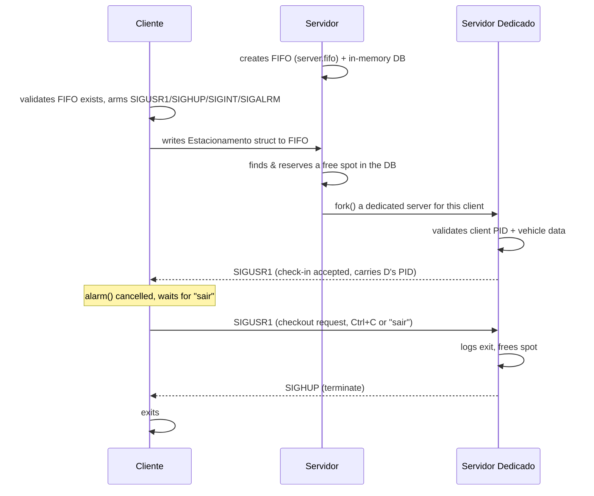
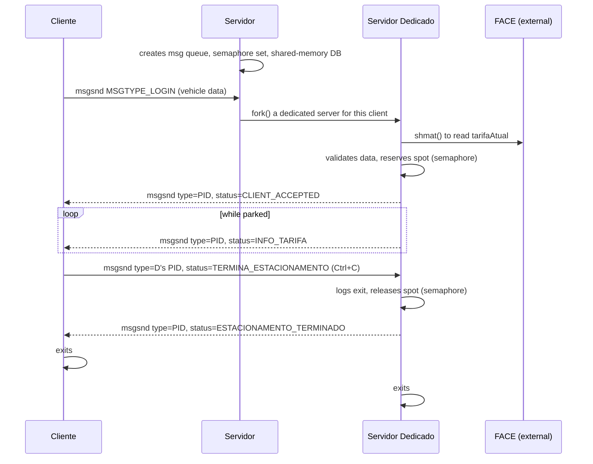

# SOproject - Park-IUL Parking Management System

**Course:** Sistemas Operativos (Operating Systems), 2024/2025 - ISCTE-IUL
**Author:** Gonçalo Sobral

Park-IUL is a parking-garage management system built as three progressively more
advanced deliverables for the Operating Systems course: a set of Bash scripts for
record-keeping, a C client/server built on FIFOs and Unix signals, and a second C
client/server rebuilt on top of System IPC (message queues, semaphores, and shared
memory).

## Repository Structure

```
SOproject/
├── parte1-shell/                 # Part 1 - Bash scripts (log management & stats)
│   ├── cron.def
│   ├── manutencao.sh
│   ├── menu.sh
│   ├── regista_passagem.sh
│   └── stats.sh
├── parte2-processos-sinais/      # Part 2 - C client/server over FIFOs & signals
│   ├── cliente.c
│   ├── common.h
│   └── servidor.c
└── parte3-ipc/                   # Part 3 - C client/server over System V IPC
    ├── cliente.c
    ├── common.h
    ├── defines.h
    └── servidor.c
```

---

## `parte1-shell/` - Bash Scripts

A collection of Bash scripts that manage vehicle entry/exit logs stored in plain text
files, plus reporting and scheduled maintenance.

| File | Purpose |
|---|---|
| `regista_passagem.sh` | Registers a vehicle **entry** (matrícula/license_plate, país/country, categoria/category, condutor/driver) or **exit** (`país/matrícula`) in `estacionamentos.txt`. Validates argument count, license-plate format against `paises.txt`, driver name against a `/etc/passwd`-style file, and prevents duplicate entries/exits. Also maintains `estacionamentos-ordenados-hora.txt`, sorted by entry time. |
| `manutencao.sh` | Validates the integrity of `estacionamentos.txt` (valid country codes, valid plate formats, exit date after entry date). Moves **completed** records (with both entry and exit) into monthly archive files named `arquivo-<Year>-<Month>.park`, appending the computed parking duration in minutes. Keeps only still-open records in `estacionamentos.txt`. |
| `stats.sh` | Generates `stats.html` with up to 7 statistics computed from `estacionamentos.txt` and the `arquivo-*.park` archives: currently parked vehicles, top-3 longest stays, total time per country (excluding motorcycles), top-3 latest entries, total time per driver, total time per plate grouped by country, and top-3 longest driver names. Can be run with specific stat numbers as arguments, or with none to run all. |
| `menu.sh` | Interactive front-end that prompts the user, collects the required input, and dispatches to `regista_passagem.sh`, `manutencao.sh`, or `stats.sh` accordingly. Loops until the user selects "Sair" (0). |
| `cron.def` | Crontab definition to run `manutencao.sh` automatically twice on weekdays (05:59 and 13:01). |

**Record format** (`estacionamentos.txt`):
```
<Matrícula>:<País>:<Categoria>:<Condutor>:<DataEntrada>[:<DataSaída>]
```

**Archive format** (`arquivo-<Ano>-<Mês>.park`):
```
<Matrícula>:<País>:<Categoria>:<Condutor>:<DataEntrada>:<DataSaída>:<TempoParkMinutos>
```

**Input files (not included - you must create these):**

`paises.txt` - one country per line, `###`-separated, mapping a 2-letter code to a
display name and a regex describing valid plates for that country:
```
<Código>###<Nome do País>###<Regex da Matrícula>
PT###Portugal###^[0-9]{2}-[0-9]{2}-[A-Z]{2}$
ES###Espanha###^[0-9]{4}-[A-Z]{3}$
UK###Reino Unido###^[A-Z]{2}[0-9]{2}[A-Z]{3}$
```

A user database (`FILE_USERS`, e.g. `/etc/passwd` or a local copy) is also required
for driver-name validation, in the standard `/etc/passwd` layout
(`login:x:uid:gid:Full Name:home:shell`) - the driver's full name is matched against
the GECOS (5th) field.

**Run it:**
```bash
cd parte1-shell
./menu.sh
```

**Example session:**
```
$ ./menu.sh
Menu:
1: Regista passagem - Entrada Estacionamento
2: Regista passagem - Saída Estacionamento
3: Manutenção
4: Estatísticas:
0: Sair
Opção: 1
Regista passagem de Entrada estacionamento:
Indique a matrícula da viatura: 12-34-AB
Indique o código do país de origem da viatura: PT
Indique a categoria da viatura [L(igeiro)|P(esado)|M(otociclo)]: L
Indique o nome do condutor da viatura: Gonçalo Sobral
[so_success] S1.1 Argumentos validados
[so_success] S1.2 Validação concluída
[so_success] S1.3 Registo feito com sucesso
[so_success] S1.4 Ordem por hora alterada
[so_success] S4.3 Passagem da entrada registada
Opção: 0
A sair ...
```

**Suggested `.gitignore`** (generated/runtime files that shouldn't be committed):
```gitignore
# Part 1 - generated data & reports
estacionamentos.txt
estacionamentos-ordenados-hora.txt
arquivo-*.park
stats.html

# Parts 2 & 3 - compiled binaries
servidor
cliente
*.o
*.fifo
```

---

## `parte2-processos-sinais/` - Client/Server over FIFOs & Signals

A C implementation of the parking system using a **named pipe (FIFO)** for the initial
request and **Unix signals** for all subsequent client ↔ server coordination.

Files: `servidor.c`, `cliente.c`, `common.h`

Communication flow:
1. The main **Servidor** creates the FIFO (`server.fifo`) and a shared database
   (`Estacionamento` array) in memory.
2. A **Cliente** validates that the FIFO exists, arms handlers for `SIGUSR1`,
   `SIGHUP`, `SIGINT`, and `SIGALRM`, collects vehicle data, and writes an
   `Estacionamento` struct to the FIFO.
3. The Servidor reads the request, checks for a free spot, and `fork()`s a
   **Servidor Dedicado** to handle that specific client for the rest of its stay.
4. The Servidor Dedicado validates the data, reserves the spot, and signals the
   client with `SIGUSR1` (check-in accepted) - the client's handler captures the
   dedicated server's PID from `siginfo_t`.
5. On checkout, the client sends `SIGUSR1` back to its dedicated server; the
   dedicated server logs the exit, frees the spot, and replies with `SIGHUP` to
   terminate the client.
6. `Ctrl+C` on the client triggers the same graceful checkout sequence.
   `SIGALRM` enforces a maximum wait (`MAX_ESPERA`) for the initial server reply.

Key structures (`common.h`): `Viatura`, `Estacionamento`, `LogItem`.



**Build & run:**
```bash
cd parte2-processos-sinais
gcc -o servidor servidor.c -Wall
gcc -o cliente cliente.c -Wall

./servidor <parking_capacity>   # in one terminal
./cliente                       # in another terminal (repeat for more clients)
```

**Example session:**
```
# Terminal 1
$ ./servidor 5
[so_success] S1.4 FIFO do servidor criado com sucesso
[so_success] S2.1 A aguardar pedidos...

# Terminal 2
$ ./cliente
[so_success] C1.1 FIFO do servidor validado com sucesso
Introduza a matrícula do veículo: 12-34-AB
Introduza o país (código de 2 letras): PT
Introduza a categoria do veículo (um caractere): L
Introduza o nome do condutor: Gonçalo Sobral
[so_success] C4.1 Check-in realizado com sucesso
Digite 'sair' para terminar o estacionamento: sair
[so_success] C5.2 Terminou
```

---

## `parte3-ipc/` - Client/Server over System V IPC

A rewrite of the parking system that replaces FIFOs and signals with **System V
message queues**, **semaphores**, and **shared memory**, adding a second external
service (FACE) that publishes a live parking rate.

Files: `servidor.c`, `cliente.c`, `common.h`, `defines.h`

- `defines.h` defines the shared `IPC_KEY` (derived from the student number) used by
  both client and server to attach to the same IPC resources.

Communication flow:
1. The **Servidor** creates a message queue, a semaphore set (mutexes for the DB and
   log file, a counter for dedicated-server shutdown, and a counter for free spots),
   and a shared-memory parking database.
2. The **Cliente** attaches to the existing message queue, collects vehicle data, and
   sends a `MsgContent` message tagged `MSGTYPE_LOGIN`.
3. The Servidor receives login messages, and for each one `fork()`s a **Servidor
   Dedicado**, which validates the vehicle data, attaches to the external FACE
   shared-memory segment to read `tarifaAtual` (current rate), reserves a spot under
   semaphore protection, and logs the entry.
4. The dedicated server replies to the client (message type = client PID) with a
   `CLIENT_ACCEPTED` status, then periodically sends `INFO_TARIFA` updates.
5. The client can end its stay with `Ctrl+C`, which sends a
   `TERMINA_ESTACIONAMENTO` message to its dedicated server; the dedicated server
   logs the exit, releases the spot semaphore, and replies with
   `ESTACIONAMENTO_TERMINADO`, after which both processes exit.
6. `SIGALRM` on the client enforces the same login timeout as Part 2.

Message status codes (`common.h`): `CLIENT_ACCEPTED`, `ESTACIONAMENTO_TERMINADO`,
`INFO_TARIFA`, `TERMINA_ESTACIONAMENTO`.

IPC resources are released cleanly by the server on shutdown
(`s4_3_ApagaElementosIPCeTermina`).



**Build & run:**
```bash
cd parte3-ipc
gcc -o servidor servidor.c -Wall
gcc -o cliente cliente.c -Wall

./servidor <parking_capacity>   # in one terminal
./cliente                       # in another terminal (repeat for more clients)
```

**Example session:**
```
# Terminal 1
$ ./servidor 5
[so_success] S1.3 Message Queue criada com sucesso
[so_success] S1.4 Grupo de semáforos criado com sucesso
[so_success] S1.5 BD do parque criada em memória partilhada
[so_success] S2 A aguardar pedidos...

# Terminal 2
$ ./cliente
Park-IUL: Check-in Viatura
----------------------------
Introduza a matrícula da viatura: 12-34-AB
Introduza o país da viatura: PT
Introduza a categoria da viatura: L
Introduza o nome do condutor: Gonçalo Sobral
[so_success] C4.1 Check-in realizado com sucesso
[so_success] C5 Tarifa atual: 0.75 €/hora
^C
[so_success] C6 Cliente: Shutdown
```

---

## Requirements & Known Limitations

⚠️ **This project cannot be built or run outside the ISCTE-IUL server.**

All three parts depend on `so_utils`, a helper library provided by the course that is
**not included in this repository** and is only available on the ISCTE server:

- `parte2-processos-sinais/common.h` and `parte3-ipc/common.h` both hardcode:
  ```c
  #include "/home/so/utils/include/so_utils.h"
  ```
- `parte1-shell` scripts source it the same way:
  ```bash
  . so_utils.sh
  ```

This header/script provides the `so_success`, `so_error`, `so_debug`, and `so_gets`
macros used throughout every file. Without access to `/home/so/utils/` (i.e. without
being on the ISCTE server, or without a local copy of `so_utils.h`/`so_utils.sh`), the
code will not compile or run.

There are also two other things that only work as expected on the ISCTE server:

- **Driver-name validation** (`regista_passagem.sh`, and `sd8_4_ValidaNomeCondutor` in
  both `parte2-processos-sinais` and `parte3-ipc`) checks the driver's name against
  `/etc/passwd` (or a local copy of it, `FILE_USERS`), i.e. against real ISCTE user
  accounts. Running elsewhere will validate against a different set of users.
- **`parte3-ipc`** additionally expects an external **FACE** process (Federação
  Automóvel de Controlo de Estacionamentos) already running on the server, which
  publishes the current parking rate through a shared-memory segment identified by
  `KEY_FACE (0x0FACE)`. Without that process running, the dedicated server's
  `shmget`/`shmat` calls to the FACE segment will fail.

> Uncomment `#define SO_HIDE_DEBUG` at the top of any `.c`/`.sh` file to silence
> `@DEBUG` trace output (once the code is actually able to build).